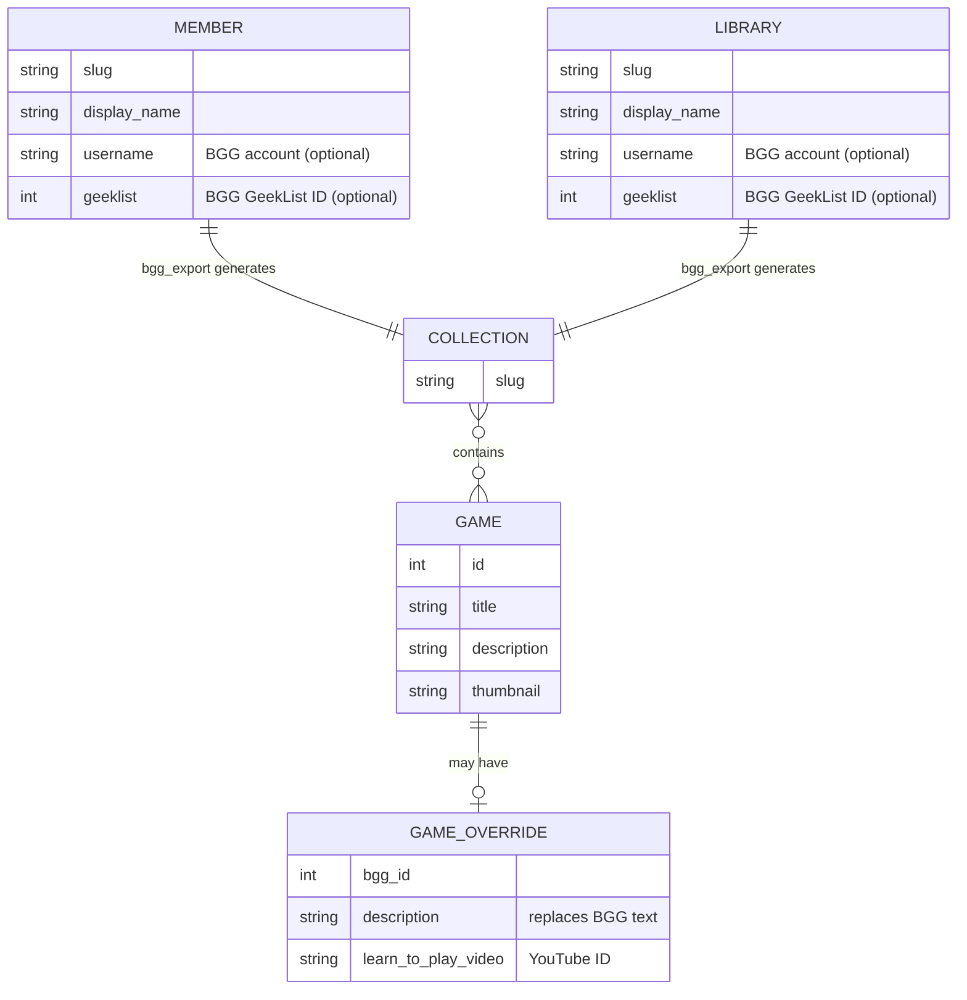

# Developer guide

Technical reference for working on the Shiny Hoppy Meeple website itself — running it locally,
understanding the architecture, and deploying. If you only want to **submit content** (posts,
members, libraries), you don't need any of this — see the [contributor guide](../CONTRIBUTING.md).

- **Site:** [shiny-hoppy-meeple.pages.dev](https://shiny-hoppy-meeple.pages.dev)
- **Stack:** [Hugo](https://gohugo.io/) static site (PaperMod theme) + [Cloudflare Pages](https://pages.cloudflare.com/)
  Functions backed by Workers KV.
- **Content model:** most content is generated from **GitHub Issues** via Actions workflows, not
  hand-edited.

## Repository layout

```text
.
├── bgg_export.py              # BoardGameGeek → JSON generator (the data pipeline)
├── requirements.txt           # pinned Python deps for bgg_export.py
├── package.json               # pinned dev tooling (markdownlint-cli2, wrangler)
├── .github/
│   └── workflows/*.yml        # deploy + BGG cache update
└── shiny-hoppy-meeple/        # the Hugo site (all Hugo/wrangler commands run from here)
    ├── hugo.toml              # site config
    ├── calendar-sync.js       # Google Calendar → data/calendar.json
    ├── sheets-sync.js         # Google Sheets → data/definitions/ (members, libraries, overrides)
    ├── content/               # pages & posts (Markdown)
    ├── layouts/               # PaperMod overrides (game/member pages, custom outputs)
    ├── data/                  # generated + source JSON (see "BGG data pipeline")
    ├── static/                # images, JS; images/games/ and images/posts/ are generated
    ├── functions/             # Cloudflare Pages Functions (play counting)
    ├── wrangler.toml          # Cloudflare project name, output dir, KV binding
    └── themes/PaperMod        # git submodule
```

## Prerequisites

- **Hugo** (extended), pinned — match the version used by the deploy workflow and the
  `.devcontainer`.
- **Node.js** + npm (dev tooling).
- **Python 3** (for `bgg_export.py`).
- A devcontainer is provided (`.devcontainer/`) with Hugo preinstalled — the simplest way to get a
  matching environment.

## Setup

```bash
# Clone WITH submodules — the PaperMod theme is a submodule
git clone --recurse-submodules https://github.com/thjont/shm.git
# or, if already cloned:
git submodule update --init --recursive

npm install                          # dev tooling (markdownlint-cli2, wrangler), pinned
pip install -r requirements.txt      # bgg-api + pinned deps for bgg_export.py
```

## Local development

All Hugo and wrangler commands run from **inside `shiny-hoppy-meeple/`**.

```bash
cd shiny-hoppy-meeple

hugo server                 # dev server with live reload → http://localhost:1313
hugo --minify               # production build → public/
wrangler pages dev public   # serve the build + Functions + KV locally (test /p/, /api/plays)
```

From the repo root:

```bash
npm run lint                # markdownlint-cli2 "**/*.md"
```

> [!IMPORTANT]
> Use `wrangler pages dev` (not just `hugo server`) when testing anything under `functions/` —
> the play-count redirects (`/p/`, `/lets-play/`) and `/api/plays` only run under wrangler, which
> provides the KV binding.

## Architecture

### 1. Content management

Content on the site comes from three sources:

**Google Sheets** — members, shadow libraries, and game overrides are rows in the
[site data spreadsheet](GOOGLE-SETUP.md). `sheets-sync.js` reads the sheet at the start of every
build and writes the definition JSON files into `data/definitions/`. Deleting a row from the sheet
removes the corresponding definition on the next build. See [GOOGLE-SETUP.md](GOOGLE-SETUP.md) for
spreadsheet setup and column reference.

**BGG data pipeline** — `bgg_export.py` reads those definition files and fetches the actual game
data from BoardGameGeek. This runs on a daily schedule (see Deployment below).

**Direct commits** — blog posts are Markdown files under `content/posts/`, committed directly to
the repo by maintainers.

### 2. BGG data pipeline (`bgg_export.py`)

`bgg_export.py` turns BoardGameGeek collections / geeklists into the JSON that Hugo renders. The
`data/` directory has a clean two-tier split:



**Definitions — `data/definitions/`** — small editorial configs that drive page creation.
Generated at build time by `sheets-sync.js` from the site data spreadsheet; not committed to the
repo (except `libraries/main-library.json`, which is static).

| File | Purpose |
| --- | --- |
| `members/<slug>.json` | `slug`, `display_name`, optional `description`, `username` (BGG account) or `geeklist` (ID) |
| `libraries/main-library.json` | Main library definition (static, committed) |
| `libraries/<slug>.json` | Shadow / supplementary library definition (generated from sheet) |
| `games-bgg-override/<id>.json` | Override `description` and/or `learn_to_play_video` for a game |

Each definition specifies exactly one BGG source — `username` *or* `geeklist`, never both.

**Cache — `data/bgg-cache/`** — large generated outputs produced by running `bgg_export.py`.

| File | Purpose |
| --- | --- |
| `collections/<slug>.json` | Collection summary: count + items (main library, members, shadow libraries) |
| `games/<id>.json` | Full game detail for every game that appears in any collection |

Images are downloaded to `static/images/games/`; the JSON is rewritten to local paths while
originals are kept in `*_source` fields.

Regenerating data (writes into `shiny-hoppy-meeple/data/bgg-cache/`):

```bash
BGG_API_TOKEN=<token> BGG_USERNAME=<user> python bgg_export.py        # a user collection
python bgg_export.py --geeklist <id>                                  # a public geeklist
python bgg_export.py --geeklist <id> --collection-file data/bgg-cache/collections/<slug>.json   # a member
```

> [!NOTE]
> `sheets-sync.js` writes the **definition** files; running `bgg_export.py` produces the large
> generated JSON and images. New members/libraries don't fully appear until the export runs.

### 3. Custom layouts (`shiny-hoppy-meeple/layouts/`)

PaperMod theme with overrides:

- `g/single.html` — game pages; merges override data and computes owners / in-library across members.
- `m/` — member pages.
- `_default/stats.html` — the stats page.
- `index.scanslugs.json` — a custom Hugo output format emitting `/scan-slugs.json`, the **allowlist
  of valid game slugs** consumed by the Functions below.

### 4. Cloudflare Pages Functions + KV

`shiny-hoppy-meeple/functions/` adds server-side logic on top of the static site, backed by a
Workers KV namespace bound as `SCANS` (see `wrangler.toml`):

- QR stickers on physical games hit `/p/<slug>` or `/lets-play/<slug>` →
  `functions/_lib/play-handler.js` increments the play count in KV (**only** for slugs present in
  `/scan-slugs.json`, to keep junk out of KV) and 302-redirects to `/g/<slug>/`.
- `api/plays.js` serves the counts.
- `static/js/` fetches counts client-side via `data-*-slug` attributes, so counts never block static
  rendering.

> [!IMPORTANT]
> **Deploy and `wrangler pages dev` must run from `shiny-hoppy-meeple/`** so wrangler discovers
> `functions/` and reads `wrangler.toml` (project name, output dir, KV binding). `functions/` and
> `wrangler.toml` sit at the Hugo root, but Hugo ignores them.

## Deployment

| Workflow | Trigger | Action |
| --- | --- | --- |
| `deploy-prod.yml` | Push to `main` touching `shiny-hoppy-meeple/**`, or hourly schedule | Sheets sync → calendar sync → `hugo --minify` → **production** deploy |
| `deploy-stage.yml` | Push to `main` touching `shiny-hoppy-meeple/**` | Sheets sync → `hugo --minify --buildFuture` → **stage** deploy |
| `deploy-dev.yml` | Push to `dev` touching `shiny-hoppy-meeple/**` | Sheets sync → calendar sync → `hugo --minify --buildFuture` → **dev** deploy |
| `update-bgg-cache.yml` | Daily at 4 am, or manual | Sheets sync → `bgg_export.py` for all members/libraries → commit cache → prod + stage deploy |

Required repository secrets: `CLOUDFLARE_API_TOKEN`, `CLOUDFLARE_ACCOUNT_ID`,
`GOOGLE_SERVICE_ACCOUNT_KEY`, `GOOGLE_CALENDAR_ID`, `GOOGLE_SHEETS_SPREADSHEET_ID`,
`BGG_API_TOKEN`.

## Dependency pinning

Everything is version-pinned for reproducible builds:

- `requirements.txt` (full pip tree)
- `package.json` + `package-lock.json`
- all GitHub Actions pinned to commit SHAs
- Hugo pinned to a fixed version
- the devcontainer Hugo feature

When bumping a tool, update it in **all** of these — workflows, `.devcontainer/devcontainer.json`,
and the relevant lock/requirements file. Dependabot is configured (`.github/dependabot.yml`) for
version updates.

## Gotchas

- **Play-count slug = the anchorized game *name*.** Renaming a game changes its slug and orphans the
  play count tied to any printed QR sticker. **Finalise game names before generating QR codes.**
- **Submodule.** A fresh clone without `--recurse-submodules` is missing the PaperMod theme and Hugo
  builds will fail; run `git submodule update --init --recursive`.
- **Test Functions under wrangler, not `hugo server`** — see local development above.

## See also

- [`CLAUDE.md`](../CLAUDE.md) — condensed architecture notes for AI assistants (kept in sync with
  this guide).
- [Contributor guide](../CONTRIBUTING.md) — the non-technical, issue-based content workflow.
