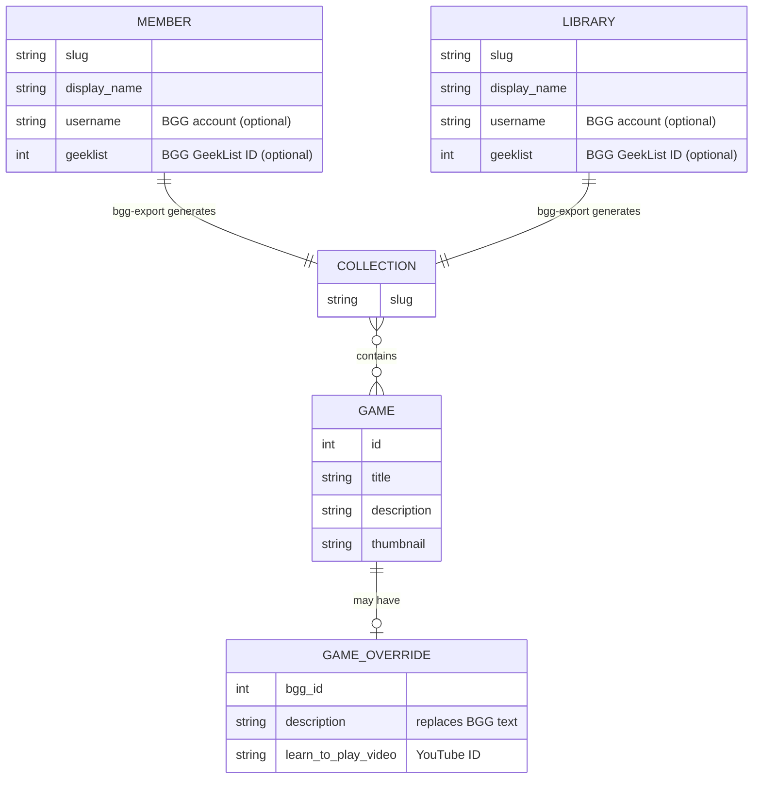

# Developer guide

Technical reference for working on the Shiny Hoppy Meeple website itself — running it locally,
understanding the architecture, and deploying. If you only want to **submit content** (posts,
members, libraries, events), you don't need any of this — see the
[contributor guide](CONTRIBUTING.md).

- **Site:** [shiny-hoppy-meeple.pages.dev](https://shiny-hoppy-meeple.pages.dev)
- **Stack:** [Hugo](https://gohugo.io/) static site ([Blowfish](https://blowfish.page/) theme) +
  [Cloudflare Pages](https://pages.cloudflare.com/) Functions backed by Workers KV.
- **Content model:** most content is generated at build time from **Google Sheets, Google
  Calendar, and BoardGameGeek** — not hand-edited. Only blog posts are committed directly.

## Repository layout

```text
.
├── justfile                   # task runner: just serve / build / dev / lint / …
├── package.json               # pinned tooling (eslint, markdownlint-cli2, wrangler) + script deps
├── scripts/
│   ├── bgg-export.js          # BoardGameGeek → JSON generator (the data pipeline)
│   ├── bgg-export-members.js  # runs bgg-export.js for every member definition
│   ├── sheets-sync.js         # Google Sheets → data/definitions/ (members, libraries, overrides)
│   ├── calendar-sync.js       # Google Calendar → data/calendar.json + event page stubs
│   ├── cleanup-stale-cache.js # deletes cache entries no longer referenced by any definition
│   ├── cache-pull.sh          # restore the BGG cache from its orphan branch
│   ├── cache-push.sh          # commit BGG cache changes back to its orphan branch
│   └── generate-qr-pdf.js     # print-ready QR sticker PDF (see scripts/README.md)
├── google-apps-script/        # manual deploy button for non-GitHub maintainers (DEPLOY-BUTTON.md)
├── .github/
│   └── workflows/*.yml        # CI + deploys + daily BGG cache update
└── shiny-hoppy-meeple/        # the Hugo site (all Hugo/wrangler commands run from here)
    ├── hugo.toml              # site config
    ├── content/               # pages & posts (Markdown) + content adapters (_content.gotmpl)
    ├── layouts/               # Blowfish overrides (game/member pages, custom outputs)
    ├── data/                  # generated + source JSON (see "BGG data pipeline")
    ├── assets/                # custom css & JS, piped through Hugo (minify + fingerprint)
    ├── static/                # served verbatim; images/games/ and qr-codes.pdf are generated
    ├── functions/             # Cloudflare Pages Functions (play counting, preview auth)
    ├── wrangler.toml          # Cloudflare project name, output dir, KV binding (prod)
    ├── wrangler-{stage,dev}.toml  # per-environment variants, copied over wrangler.toml at deploy
    └── themes/blowfish        # git submodule
```

## Prerequisites

- **Hugo** (extended), pinned — match the version used by the deploy workflows and the
  `.devcontainer` (currently 0.163.1).
- **Node.js** + npm (scripts and dev tooling).
- [`just`](https://just.systems/) (optional) — wraps the common commands; run `just` to list them.
- A devcontainer is provided (`.devcontainer/`) with Hugo, Node, and Claude Code preinstalled —
  the simplest way to get a matching environment. On start it raises a **default-deny egress
  firewall** (`init-firewall.sh`) allowing only GitHub, npm, Anthropic, VS Code, and the pipeline's
  hosts (BGG, Google APIs, Cloudflare), so agents can run sandboxed inside it. Host IPs are
  resolved once at start; if a CDN-fronted host stops resolving in a long-lived container, re-run
  `sudo bash .devcontainer/init-firewall.sh`.

## Setup

```bash
# Clone WITH submodules — the Blowfish theme is a submodule
git clone --recurse-submodules https://github.com/thjont/shm.git
# or, if already cloned:
git submodule update --init --recursive

npm install                  # tooling + script deps, pinned
scripts/cache-pull.sh prod   # restore the BGG cache (or stage / dev) — see "BGG data pipeline"
```

Without a cache pull the site builds with an empty library, which is fine for testing template
changes.

## Local development

All Hugo and wrangler commands run from **inside `shiny-hoppy-meeple/`** (or use the `justfile`
recipes from the repo root).

```bash
cd shiny-hoppy-meeple

hugo server                 # dev server with live reload → http://localhost:1313
hugo --minify               # production build → public/
wrangler pages dev public   # serve the build + Functions + KV locally (test /p/, /api/plays)
```

From the repo root:

```bash
npm run lint                # lint:md + lint:js
npm run lint:md             # markdownlint-cli2 "**/*.md"
npm run lint:js             # eslint .
```

> [!IMPORTANT]
> Use `wrangler pages dev` (not just `hugo server`) when testing anything under `functions/` —
> the play-count redirects (`/p/`, `/lets-play/`, `/learn-to-play/`) and the `/api/` endpoints only
> run under wrangler, which provides the KV binding.

## Architecture

### 1. Content management

Content on the site comes from four sources:

**Google Sheets** — members, shadow libraries, and game overrides are rows in the
[site data spreadsheet](GOOGLE-SETUP.md). `scripts/sheets-sync.js` reads the sheet at the start of
every build and writes the definition JSON files into `data/definitions/`. Deleting a row from the
sheet removes the corresponding definition on the next build. See [GOOGLE-SETUP.md](GOOGLE-SETUP.md)
for spreadsheet setup and column reference.

**Google Calendar** — `scripts/calendar-sync.js` runs at the start of every build, writing upcoming
events to `data/calendar.json` (rendered by `layouts/_default/events.html`) and creating stub pages
under `content/events/` for events that don't have one. Both are build-time artifacts, not
committed.

**BGG data pipeline** — `scripts/bgg-export.js` reads the definition files and fetches the actual
game data from BoardGameGeek. This runs on a daily schedule (see Deployment below).

**Direct commits** — blog posts are Markdown files under `content/posts/`, committed directly to
the repo by maintainers.

### 2. BGG data pipeline (`scripts/bgg-export.js`)

`bgg-export.js` turns BoardGameGeek collections / geeklists into the JSON that Hugo renders
(`scripts/bgg-export-members.js` loops it over every member definition). The `data/` directory has
a clean two-tier split:


```mermaid
erDiagram
    MEMBER {
        string slug
        string display_name
        string username "BGG account (optional)"
        int geeklist "BGG GeekList ID (optional)"
    }
    LIBRARY {
        string slug
        string display_name
        string username "BGG account (optional)"
        int geeklist "BGG GeekList ID (optional)"
    }
    COLLECTION {
        string slug
    }
    GAME {
        int id
        string title
        string description
        string thumbnail
    }
    GAME_OVERRIDE {
        int bgg_id
        string description "replaces BGG text"
        string learn_to_play_video "YouTube ID"
    }

    MEMBER ||--|| COLLECTION : "bgg-export generates"
    LIBRARY ||--|| COLLECTION : "bgg-export generates"
    COLLECTION }o--o{ GAME : contains
    GAME ||--o| GAME_OVERRIDE : "may have"
```

**Definitions — `data/definitions/`** — small editorial configs that drive page creation.
Generated at build time by `sheets-sync.js` from the site data spreadsheet; not committed to the
repo (except `libraries/main-library.json`, which is static).

| File | Purpose |
| --- | --- |
| `members/<slug>.json` | `slug`, `display_name`, optional `description`, `username` (BGG account) or `geeklist` (ID) |
| `libraries/main-library.json` | Main library definition (static, committed) |
| `libraries/<slug>.json` | Shadow / supplementary library definition (generated from sheet) |
| `games-bgg-override/<id>.json` | Override `description` and/or `learn_to_play_video` for a game |

Each definition specifies exactly one BGG source — `username` *or* `geeklist`, never both.

**Cache — `data/bgg-cache/`** — large generated outputs produced by running `bgg-export.js`.

| File | Purpose |
| --- | --- |
| `collections/<slug>.json` | Collection summary: count + items (main library, members, shadow libraries) |
| `games/<id>.json` | Full game detail for every game that appears in any collection |

Images are downloaded to `static/images/games/`; the JSON is rewritten to local paths while
originals are kept in `*_source` fields.

BGG serves box art at full size (up to 3000×4302 / 3.3 MB), so **hero images are resized at
export time**: `bgg-export.js` downscales them to at most 900 px wide with `sharp` and re-encodes
them as WebP (quality 80), which takes the whole image set from ~29 MB to ~6 MB. The cached file is
`<id>.webp` regardless of the source format, and the pixel dimensions are recorded in the game JSON
as `image_width`/`image_height` so `layouts/games/single.html` can set `width`/`height` on the hero
`` and avoid layout shift. Files left over in another format (a pre-resize `<id>.png`, or a
`.webp` written before a fallback) are deleted when the new one is written, since
`cleanup-stale-cache.js` only prunes images whose game id is no longer referenced. If `sharp`
can't decode an image the original bytes are kept and the export continues; the next run retries.

Thumbnails get the same treatment at their own scale: `<id>-thumb.webp`, capped at 300 px wide
(above BGG's own ~150 px, so it never upscales) at quality 65 — indistinguishable on a grid tile,
and it takes the library grid's thumbnail payload from ~463 KB to ~250 KB.

**Cache branches** — the cache is gitignored on `main`. Each environment's cache lives on an
**orphan branch** (`bgg-cache-prod`, `bgg-cache-stage`, `bgg-cache-dev`) so daily BGG data updates
never touch `main`'s history. `scripts/cache-pull.sh <stage>` restores a branch's cache into the
working tree before an export or build; `scripts/cache-push.sh <stage>` commits local cache changes
back to the branch. Both operate via a throwaway git worktree and don't disturb the current
checkout. The generated `static/qr-codes.pdf` travels with the cache too — it's derived from the
main library (see [scripts/README.md](scripts/README.md)).

Regenerating data (writes into `shiny-hoppy-meeple/data/bgg-cache/`):

```bash
BGG_API_TOKEN=<token> node scripts/bgg-export.js --library main-library    # a library definition
BGG_API_TOKEN=<token> BGG_USERNAME=<user> node scripts/bgg-export.js       # a user collection
BGG_API_TOKEN=<token> node scripts/bgg-export.js --geeklist <id>           # a public geeklist
BGG_API_TOKEN=<token> node scripts/bgg-export-members.js                   # every member definition
```

> [!NOTE]
> `sheets-sync.js` writes the **definition** files; running `bgg-export.js` produces the large
> generated JSON and images. New members/libraries don't fully appear until the export runs.

### 3. Page generation and custom layouts (`shiny-hoppy-meeple/layouts/`)

Game and member pages are created by **content adapters**, not Markdown files:

- `content/games/_content.gotmpl` — builds a page per cached game at `/games/<slug>/` (slug =
  `anchorize`d game name), merging any `games-bgg-override` data and assigning
  `categories`/`mechanics`/`complexity` taxonomy terms for games in the main library. The games
  section lists at `/library/` (set by `url` in `content/games/_index.md`).
  These taxonomies are **data-only**: a cascade in `hugo.toml` stops their pages rendering
  (`/categories/`, `/mechanics/`, `/complexity/` deep-link into the filtered library instead),
  but the terms still power the game finder's dropdowns (`site.Taxonomies`) and the term labels
  on game pages (`.GetTerms`). The `tags` taxonomy (blog posts) still renders.
  Complexity (`Light`/`Medium`/`Heavy`) is **relative to the main library**, not BGG's absolute
  scale: `partials/shm/complexity-cuts.html` splits the library's BGG weights into terciles at
  build time, so buckets stay evenly filled but a game near a cut can change bucket when the
  library or BGG weights change. `partials/shm/complexity-bucket.html` maps a weight to its
  bucket and is the single source of truth (used by the content adapter and by the game-finder's
  `data-complexity` attributes in `games/list.html`).
- `content/members/_content.gotmpl` — builds `/members/<slug>/` pages from the member definitions.

Blowfish theme with overrides:

- `games/single.html` — game pages; merges override data and computes owners / in-library across members.
- `games/list.html` — the library grid: one card per game across the main library and every
  member collection (deduped by id, `data-owners` slugs; shadow libraries excluded). The game
  finder's "Owned by" checkbox dropdown unions the checked shelves, defaulting to the main
  library when none are checked; member-only cards render pre-hidden so the no-JS view equals
  the main library. `?owner=<slug>` deep-links a member's shelf.
- `members/` — the member index and per-member **bio pages** (name, description, and a
  "Browse their N games" link into `/library/?owner=<slug>` — no game grid of their own).
- `_default/stats.html` — the stats page (play counts, ranks, the members' +1 button).
- `_default/events.html` — the calendar page rendered from `data/calendar.json`.
- `index.scanslugs.json` — a custom Hugo output format emitting `/scan-slugs.json`, the **allowlist
  of valid game slugs** consumed by the Functions below.

> [!NOTE]
> **Thumbnail fallback:** `games/list.html` falls back to the game-detail
> thumbnail when a collection item has none — geeklist-sourced collections never have one. Keep
> that fallback when editing the template.

### 4. Cloudflare Pages Functions + KV

`shiny-hoppy-meeple/functions/` adds server-side logic on top of the static site, backed by a
Workers KV namespace bound as `SCANS` (see `wrangler.toml`):

- QR stickers on physical games hit `/p/<slug>`, `/lets-play/<slug>`, or `/learn-to-play/<slug>` →
  `functions/_lib/play-handler.js` 302-redirects to `/games/<slug>/` and counts the scan from
  `context.waitUntil()`, so the person scanning never waits on two KV round trips (**only** for
  slugs present in `/scan-slugs.json`, to keep junk out of KV; it fails closed if the allowlist is
  unreadable).
- `api/plays.js` serves the QR-scan counts.
- `api/member-plays.js` serves and records member-logged plays (the POST is deliberately
  unauthenticated — accepted risk for a small community site).
- `assets/js/plays.js` fetches counts client-side via `data-*-slug` attributes, so counts never
  block static rendering.
- `_middleware.js` gates everything except the routes above behind basic auth when the
  `BASIC_AUTH_PASSWORD` environment variable is set on the Pages project (used for dev/stage
  previews; prod doesn't set it). Setting `BASIC_AUTH_USER` as well makes the username count too —
  unset, any username is accepted, as before. Both are compared with
  `crypto.subtle.timingSafeEqual`.

The shared pieces live in `functions/_lib/`:

| File | Responsibility |
| --- | --- |
| `slugs.js` | Loads the `/scan-slugs.json` allowlist through `env.ASSETS` — the deployment's own asset, so no origin round trip and no basic-auth exemption |
| `counts.js` | The `scan:` / `member:` keyspaces, cursor-looped listings, and counts read from key metadata |
| `edge-cache.js` | Cache API storage for the two GET endpoints |
| `json.js` | JSON responses with `nosniff` |
| `play-handler.js` | The shared QR-scan route |

Four things about the KV layer are easy to undo by accident:

1. **Counts live in key metadata as well as the value.** `put(key, value, { metadata: { count } })`
   means `list()` alone carries every number, turning a request into one listing instead of a
   listing plus a `get()` per game. Drop the metadata and reads still work — they just quietly go
   back to a `get()` per key.
2. **Every listing is cursor-looped.** `list()` returns at most 1,000 keys and both keyspaces share
   the namespace; the previous single-page read would have reported 0 for every key past the first
   page.
3. **`Cache-Control` does not edge-cache a Pages Function response.** Only the Cache API does, which
   is what `edge-cache.js` is for. The trade-off is deliberate staleness: up to 60s for scan counts,
   30s for member plays, and caches are per-colo so a write in one location doesn't purge another's.
4. **Scan keys are `scan:<slug>`.** Bare `<slug>` keys are the old format. Reads still honour them,
   and `play-handler.js` adopts a bare key's total into `scan:<slug>` and deletes it the next time
   that game is scanned — so the keyspace migrates itself and **no manual migration is required**.
   To convert one by hand instead: `just kv-get <slug>`, `just kv-put scan:<slug> <value>`, then
   delete the old key.

Every KV-**writing** route is deliberately unauthenticated (a QR scan can't carry credentials), so
inflated counts are an accepted risk. Quota exhaustion is not: the KV free tier allows 1,000
writes/day and the full slug list is public at `/scan-slugs.json`, so an unthrottled loop can burn
the day's writes in seconds and stop real scans counting. Two halves to the mitigation:

- **In the repo:** `play-handler.js` catches a failed `put`, logs it, and still redirects — a
  scanner standing at a table gets the game page even when the counter can't be written.
- **In the Cloudflare dashboard** (not in this repo, and not restorable from it — recreate it if the
  project is ever rebuilt): a **rate-limiting rule** on the write routes. The free plan includes
  one. Security → WAF → Rate limiting rules, ~5 requests/minute per IP, action *managed challenge*
  or *block*, matching:

  ```txt
  starts_with(http.request.uri.path, "/p/") or
  starts_with(http.request.uri.path, "/lets-play/") or
  starts_with(http.request.uri.path, "/learn-to-play/") or
  http.request.uri.path eq "/api/member-plays"
  ```

> [!IMPORTANT]
> **Deploy and `wrangler pages dev` must run from `shiny-hoppy-meeple/`** so wrangler discovers
> `functions/` and reads `wrangler.toml` (project name, output dir, KV binding). `functions/` and
> `wrangler.toml` sit at the Hugo root, but Hugo ignores them.

### 5. Custom CSS and JS

Everything of ours lives in `assets/`, not `static/`, and goes through Hugo's asset pipeline —
`resources.Get | resources.Minify | resources.Fingerprint "sha512"` — so each file is minified, gets
a content hash in its URL and carries an SRI `integrity` attribute, exactly as the theme treats its
own bundles. The fingerprint is what makes the immutable `Cache-Control` rule safe.

| Asset | Emitted by | Loaded on |
| --- | --- | --- |
| `assets/css/bgg.css` | `partials/extend-head.html` | every page |
| `assets/css/calendar.css` | `partials/extend-head-uncached.html` | section `events` only (the calendar page and each event page) |
| `assets/js/plays.js` | `partials/extend-footer.html` | every page (it exits early when a page has no count elements) |
| `assets/js/game-finder.js` | `layouts/games/list.html` | the library page |

> [!IMPORTANT]
> The theme calls `extend-head.html` as `partialCached "extend-head.html" .Site` — no page context,
> one cached result for the whole site. Anything page-conditional has to go in
> `extend-head-uncached.html`, which it calls with the page. `.Section` in the cached partial fails
> the build outright.

Adding a new stylesheet or script means putting it in `assets/`, emitting it through one of those
templates, and adding its fingerprinted glob to `static/_headers`.

### 6. Static response headers and redirects

Two plain-text files in `static/` configure Cloudflare Pages itself; Hugo copies them to the site
root, where Pages reads them.

- **`static/_redirects`** — legacy URL redirects (`/g/*`, `/our-library/*` → `/games/`).
- **`static/_headers`** — response headers for static assets:
  - Hugo's sha512-fingerprinted bundles (`main.bundle.min.*`, `appearance.min.*`,
    `lib/zoom/zoom.min.umd.*`) get `max-age=31536000, immutable` — a change always produces a new
    filename. Our own CSS and JS get the same rule for the same reason — they're fingerprinted too
    (see "Custom CSS and JS" below). Anything dropped into `static/css` or `static/js` instead would
    be unfingerprinted, so don't widen those globs to cover it.
  - `/images/games/*` gets `max-age=86400`. The filenames are BGG ids rather than content hashes,
    so a day is the ceiling that keeps the daily re-export honest.
  - Site-wide `X-Content-Type-Options: nosniff`, `X-Frame-Options: DENY`, and
    `Referrer-Policy: strict-origin-when-cross-origin`.

Prod additionally ships a `_routes.json`, copied from `routes-prod.json` into `public/` after the
Hugo build (same pattern as the `wrangler-*.toml` copies). Without it, `_middleware.js` puts `/*`
into the generated routes and every image, stylesheet and HTML request pays a Function invocation
before Pages serves it. Dev and stage deliberately ship no `_routes.json`, so their middleware keeps
gating every path for the basic-auth preview — which is also why `update-bgg-cache.yml` deletes the
file again before its stage build.

`_headers` applies **only to assets Pages serves itself** — Function responses are untouched by it,
so the JSON APIs build their responses through `functions/_lib/json.js`, which sets `nosniff`
alongside the content type. Check both locally with `wrangler pages dev public` and
`curl -I http://localhost:8788/<path>`.

## Continuous integration

`ci.yml` runs on every pull request (and pushes to `main`/`dev`) as two jobs:

- **lint** — `lint:js` is a blocking check; a failure fails the workflow. `lint:md` runs with
  `continue-on-error`, so Markdown issues are visible in the workflow log but never block a PR or
  deploy (the vendored `blowfish` theme content fails several Markdown rules and isn't ours to fix).
- **build** — the same check as `just check`: pull the dev cache read-only, then
  `hugo --renderToMemory`. eslint can't see a broken template or a changed `_content.gotmpl` data
  contract, and before this those failed first in the deploy. The cache pull is best-effort; an
  empty cache still builds, it just covers fewer pages.

### Failure visibility in the pipeline

Exports degrade rather than abort: a failed BGG batch or member leaves that entry's cached data
untouched and the rest of the refresh continues. What changes is whether anyone hears about it.

| Caller | On export failure |
| --- | --- |
| `bgg-export.js` | Warns per batch, then exits non-zero if any batch failed |
| `bgg-export-members.js` | Warns per member, then exits non-zero if any member failed |
| `deploy-prod.yml` / `deploy-stage.yml` | Log a `::warning::` and carry on — an hourly deploy shouldn't lose its cache push and deploy over one flaky fetch |
| `update-bgg-cache.yml` | Records each failure to `$RUNNER_TEMP/export-failures`, finishes the refresh, pushes and deploys, then **fails the run** in its final step |

That last row is the point: this is the authoritative daily refresh, so a wholly failed export must
not report green with stale data.

> [!NOTE]
> GitHub disables cron workflows after 60 days without repository activity, which would silently
> stop the hourly and daily runs. The daily `cache-push.sh` pushes to the `bgg-cache-*` branches
> count as activity on most days, so this is unlikely to bite — but if the crons ever go quiet,
> check the Actions tab for the "workflow disabled" notice first.

## Deployment

Every deploy workflow follows the same shape: pull the environment's cache branch → sync calendar +
sheets → export from BGG → `hugo --minify` → `wrangler pages deploy`.

| Workflow | Trigger | Action |
| --- | --- | --- |
| `deploy-prod.yml` | Push to `main` touching `shiny-hoppy-meeple/**`, hourly 8 am–11 pm, or manual | Full sync + export (`--skip-existing-games`) → push cache → **production** deploy. An hourly run with nothing new skips the build and deploy (see below); a push or manual run always deploys |
| `deploy-stage.yml` | Manual dispatch only | Full sync + export against the stage sheet/calendar/cache → `--buildFuture` → **stage** deploy |
| `deploy-dev.yml` | Push to `dev` touching `shiny-hoppy-meeple/**`, or manual | Sync only (no BGG export) → `--buildFuture` → **dev** deploy |
| `update-bgg-cache.yml` | Daily at 4 am, or manual | **Full** BGG refresh in two jobs, `prod` then `stage` → stale-cache cleanup → regenerate `qr-codes.pdf` if the main library changed → push caches (prod, dev, stage) → deploy prod + stage if anything changed |

Non-GitHub maintainers can trigger the prod/stage deploys through a Google-authenticated web
button — see [DEPLOY-BUTTON.md](DEPLOY-BUTTON.md).

### Shared steps and job layout

The three deploy workflows share their whole prefix — Node, `npm ci`, `cache-pull.sh`, the calendar
and sheets syncs, and the BGG export — through the composite action
**`.github/actions/sync-and-export`**, parameterised by `stage` plus the secrets and two flags
(`export`, `fingerprint-inputs`). Each workflow then keeps its own build-and-deploy tail, because
those genuinely differ: base URL, `--buildFuture`, which `wrangler-*.toml` is copied over, prod's
`_routes.json`, and prod's change gating.

> [!NOTE]
> It's a **composite action**, not a reusable `workflow_call` workflow, because a called workflow
> runs as its own job on its own runner — it could not hand the synced cache and definitions to the
> caller's build without pushing ~30 MB through artifacts. Composite steps run inside the caller's
> job and share its filesystem.

`update-bgg-cache.yml` deliberately doesn't use it. That workflow is the authoritative full refresh:
it exports *without* `--skip-existing-games`, runs `cleanup-stale-cache.js`, snapshots the main
library to decide whether to reprint the QR sheet, and syncs the calendar at a different point.
Different order and different flags would mean bending the action out of shape. It is now split into
a `prod` job and a `stage` job (`needs: prod`, `if: !cancelled()`), so a failed prod refresh no
longer skips stage — while still keeping this workflow's load on BGG's free API serial. Each job
reports its own export failures, since `$RUNNER_TEMP` isn't shared between jobs.

### Skipping hourly runs with nothing to deploy

The hourly cron exists to pick up sheet and calendar edits, and most hours there aren't any, so it
used to rebuild and redeploy an identical site ~16 times a day. `scripts/inputs-hash.sh` now
fingerprints the synced inputs — the generated definitions, `data/calendar.json` and the event stub
pages — into `data/bgg-cache/.inputs-hash` before the cache is pushed. Because that file rides along
on the cache branch, "did the sheet or calendar change?" collapses into "did the cache change?",
which `cache-push.sh` already reports as `changed_prod`. The build and deploy steps are gated on
`github.event_name != 'schedule' || steps.push-cache.outputs.changed_prod == 'true'`, so a push or a
manual dispatch always deploys and only a quiet cron run skips — noting the fact in the run summary.

The dotfile placement is deliberate: Hugo ignores dotfiles in `data/`, but a plain `.txt` there fails
the build with `unmarshal of format "" is not supported`.

`update-bgg-cache.yml` writes the same fingerprint (after its own calendar sync, so both workflows
hash identical state — otherwise the next hourly run would deploy for no reason).

### The cache branches hold a snapshot, not a history

`cache-push.sh` replaces `bgg-cache-<stage>` with a **single parentless commit** and force-pushes it.
Appending a commit per run pinned every superseded version of every changed image in the branch's
history forever; with a snapshot, the old blobs become unreachable and can be collected. The
trade-off, accepted because the data is derived: there's no going back to yesterday's cache — you
re-run the export instead. Both cache scripts fetch with `--force` and an explicit refspec, because
after a rewrite an ordinary fetch of the tracking ref is a non-fast-forward and would otherwise look
like the branch is missing (which would silently re-download the whole cache).

Required repository secrets: `CLOUDFLARE_API_TOKEN`, `CLOUDFLARE_ACCOUNT_ID`, `BGG_API_TOKEN`,
`GOOGLE_SERVICE_ACCOUNT_KEY`, `GOOGLE_CALENDAR_ID`, `GOOGLE_SHEETS_SPREADSHEET_ID`, and the stage
variants `GOOGLE_CALENDAR_ID_STAGE`, `GOOGLE_SHEETS_SPREADSHEET_ID_STAGE`
(see [GOOGLE-SETUP.md](GOOGLE-SETUP.md)).

## Dependency pinning

Everything is version-pinned for reproducible builds:

- `package.json` + `package-lock.json` (exact versions, no ranges)
- all GitHub Actions pinned to commit SHAs
- Hugo pinned to a fixed version
- the devcontainer Hugo feature
- **Node.js in `.node-version`** — the single source. Every `setup-node` step reads it via
  `node-version-file`, including the one inside `.github/actions/sync-and-export`, and the
  devcontainer feature matches it. Workflows used to say `node-version: "22"`, which floated: CI
  silently moved to 22.23.1 while local development sat on whatever was installed, and the two
  disagreeing is what let a Node-22-only test-runner change reach CI green-locally.

When bumping a tool, update it in **all** of these — workflows, `.devcontainer/devcontainer.json`,
and `package-lock.json`. Dependabot is configured (`.github/dependabot.yml`) for version updates.

## Gotchas

- **Play-count slug = the anchorized game *name*.** Renaming a game changes its slug and orphans the
  play count tied to any printed QR sticker. **Finalise game names before generating QR codes.**
  See [PLAYS.md](PLAYS.md).
- **Submodule.** A fresh clone without `--recurse-submodules` is missing the Blowfish theme and Hugo
  builds will fail; run `git submodule update --init --recursive`.
- **Test Functions under wrangler, not `hugo server`** — see local development above.
- **Don't commit cache output to `main`.** `data/bgg-cache/`, `static/images/games/`, and
  `static/qr-codes.pdf` belong to the `bgg-cache-*` branches; they're gitignored for a reason.

## See also

- [`CLAUDE.md`](CLAUDE.md) — condensed architecture notes for AI assistants.
- [Contributor guide](CONTRIBUTING.md) — the sheet/calendar content workflow for non-developers.
- [PLAYS.md](PLAYS.md) — how play counting and QR stickers work.
- [scripts/README.md](scripts/README.md) — the pipeline scripts, including the QR-PDF generator.
